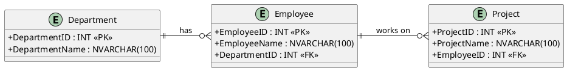
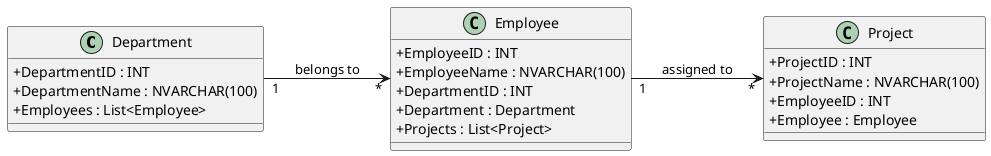

#

## ER diagram
[3つのテーブル](./tables3.jpg)

## Entity Class
```CSharp
using System.Collections.Generic;
using System.ComponentModel.DataAnnotations;
using System.ComponentModel.DataAnnotations.Schema;
```
```CSharp
public class Department
{
    [Key] // 主キーの定義
    public int DepartmentID { get; set; }

    [Required] // NULLを許容しない
    [StringLength(100)] // 文字数制限
    public string DepartmentName { get; set; }

    // ナビゲーションプロパティ: 1つの部門に複数の社員
    public ICollection<Employee> Employees { get; set; }
}
```

```CSharp
public class Employee
{
    [Key] // 主キーの定義
    public int EmployeeID { get; set; }

    [Required] // NULLを許容しない
    [StringLength(100)]
    public string EmployeeName { get; set; }

    [ForeignKey("Department")] // 外部キーの指定
    public int DepartmentID { get; set; }

    // ナビゲーションプロパティ: 部署への参照
    public Department Department { get; set; }

    // 1人の社員が複数のプロジェクトを担当する
    public ICollection<Project> Projects { get; set; }
}
```

```CSharp
public class Project
{
    [Key] // 主キーの定義
    public int ProjectID { get; set; }

    [Required]
    [StringLength(100)]
    public string ProjectName { get; set; }

    [ForeignKey("Employee")] // 外部キーの指定
    public int EmployeeID { get; set; }

    // ナビゲーションプロパティ: 社員への参照
    public Employee Employee { get; set; }
}
```

## DbContext
```CSharp
using Microsoft.EntityFrameworkCore;

public class ApplicationDbContext : DbContext
{
    public DbSet<Department> Departments { get; set; }
    public DbSet<Employee> Employees { get; set; }
    public DbSet<Project> Projects { get; set; }

    protected override void OnConfiguring(DbContextOptionsBuilder optionsBuilder)
    {
        optionsBuilder.UseSqlServer(
            "Server=your_server_name;Database=your_database_name;Trusted_Connection=True;");
    }

    // 明示的なリレーション設定が不要なため、OnModelCreatingは省略可能
}
```

## 追加
```CSharp
using (var context = new ApplicationDbContext())
{
    // 部署の追加
    var department = new Department { DepartmentName = "Human Resources" };
    context.Departments.Add(department);
    context.SaveChanges();

    // 社員の追加
    var employee = new Employee { EmployeeName = "Alice", DepartmentID = department.DepartmentID };
    context.Employees.Add(employee);
    context.SaveChanges();

    // プロジェクトの追加
    var project = new Project { ProjectName = "Employee Onboarding", EmployeeID = employee.EmployeeID };
    context.Projects.Add(project);
    context.SaveChanges();
}
```
外部キー（Foreign Key）の「所属先」が 親、そして外部キーを保持している側が 子
```text
Department (親)
   └── Employee (子 / 親)
           └── Project (子)
```
Department → Employee → Project の順でデータを追加する

## Entity-Relationship Diagram


## Class Diagram

