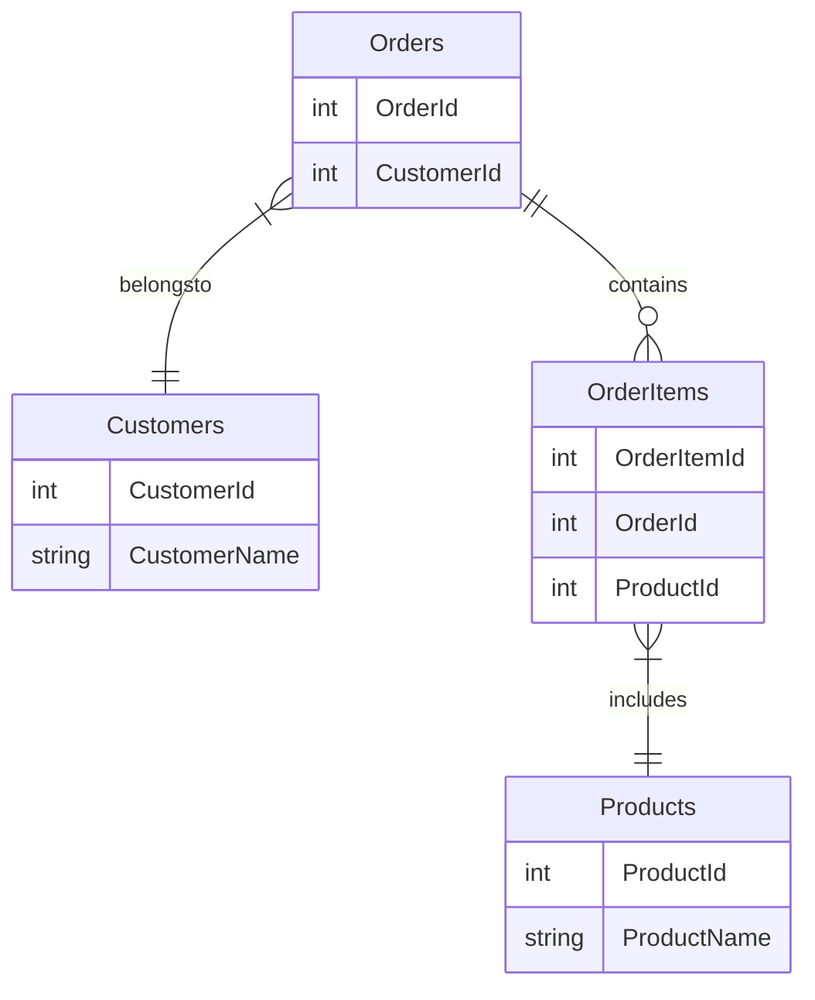
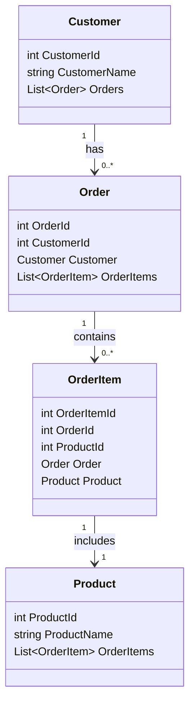
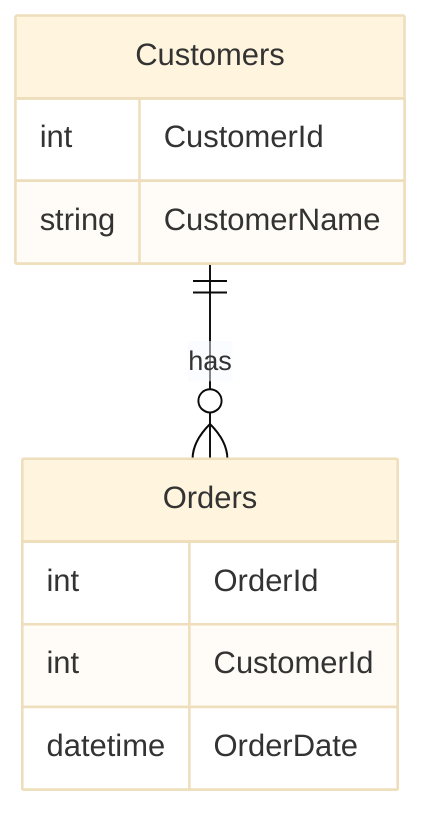
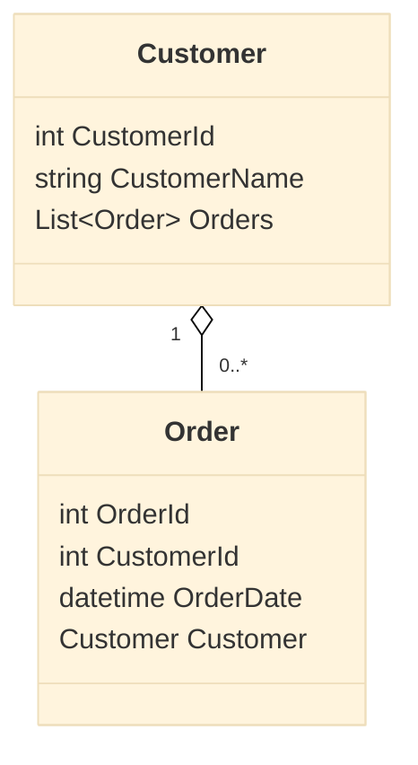
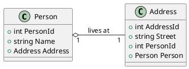
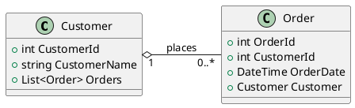

# pub




```plantUML

@startuml DB

entity Orders {
    +int OrderId
    +int CustomerId
}

entity Customers {
    +int CustomerId
    +string CustomerName
}

entity OrderItems {
    +int OrderItemId
    +int OrderId
    +int ProductId
}

entity Products {
    +int ProductId
    +string ProductName
}

Orders ||--o{ OrderItems : contains
Orders }|--|| Customers : belongs to
OrderItems }|--|| Products : includes
@enduml

```
---

```plantUML
@startuml
class Customer {
    +int CustomerId
    +string CustomerName
    +List<Order> Orders
}

class Order {
    +int OrderId
    +int CustomerId
    +Customer Customer
    +List<OrderItem> OrderItems
}

class OrderItem {
    +int OrderItemId
    +int OrderId
    +int ProductId
    +Order Order
    +Product Product
}

class Product {
    +int ProductId
    +string ProductName
    +List<OrderItem> OrderItems
}

Customer "1" o-- "0..*" Order : has
Order "1" *-- "0..*" OrderItem : contains
OrderItem "1" *-- "1" Product : includes
@enduml

```

## 単体テストでDBリセット
### ER
```PlantUML
@startuml DB

left to right direction

entity Customers {
    +int CustomerId
    +string CustomerName
}

entity Orders {
    +int OrderId
    +int CustomerId
    +datetime OrderDate
}

Customers ||--o{ Orders : has
@enduml
```

### Class
```plantUML
@startuml
left to right direction
class Customer {
    +int CustomerId
    +string CustomerName
    +List<Order> Orders
}

class Order {
    +int OrderId
    +int CustomerId
    +datetime OrderDate
    +Customer Customer
}
Customer "1" o-- "0..*" Order
@enduml
```

### DbContext
```CSharp
// DBContext
public class TestDbContext : ApplicationDbContext
{
    protected override void OnConfiguring(DbContextOptionsBuilder optionsBuilder)
    {
        // In-memoryデータベースを使用する設定
        optionsBuilder.UseInMemoryDatabase("TestDatabase");
    }
}
```
```CSharp
// テスト実行
using Microsoft.EntityFrameworkCore;
using Xunit;

public class CustomerOrderTests
{
    [Fact]
    public void CanAddAndRetrieveCustomerAndOrders()
    {
        // Arrange: テスト用のDbContextを作成
        using (var context = new TestDbContext())
        {
            // テストデータベースをクリーンにする
            context.Database.EnsureDeleted();
            context.Database.EnsureCreated();

            // サンプルデータを追加
            var customer = new Customer { CustomerName = "Hello World" };
            context.Customers.Add(customer);
            context.Orders.Add(new Order { Customer = customer, OrderDate = DateTime.Now });
            context.SaveChanges();
        }

        // Act: データベースからデータを取得
        using (var context = new TestDbContext())
        {
            var customers = context.Customers
                .Include(c => c.Orders)
                .ToList();

            // Assert: 取得したデータの検証
            Assert.Single(customers);
            var customer = customers.First();
            Assert.Equal("John Doe", customer.CustomerName);
            Assert.Single(customer.Orders);
        }
    }
}
```
## HasOne WithOne
|API| 関連| Notes|
|:---|:---|:---|
|HasOne|1..1 or 1..*|他のEntityのインスタンスを持つ|
|WithOne|1..1 |他のEntityに対して1つのインスタンスとして関連づけられている|
### 1..1



### 1..*


## SQLクエリのトレース

```csharp
protected override void OnConfiguring(DbContextOptionsBuilder optionsBuilder)
{
    optionsBuilder
        .UseSqlServer("YourConnectionString")
        .UseLazyLoadingProxies()
        .LogTo(Console.WriteLine, new[] { DbLoggerCategory.Database.Command.Name }, Microsoft.Extensions.Logging.LogLevel.Information);
}
```

## 遅延読み込み

1. パフォーマンス

遅延読み込みにより、多くの小さなクエリが発行される可能性がある。
パフォーマンスに影響を与えることがある。
コレクションプロパティに対する遅延読み込みが多くのエンティティを返す場合、
N+1クエリ問題が発生することがある。

2. トランザクション管理

遅延読み込みは、データベースコンテキストが有効であり続ける間に実行される。
コンテキストが既に破棄されている場合、遅延読み込みは失敗する。


遅延読み込みが有効な場合、
ナビゲーションプロパティにアクセスすると関連データが自動的に読み込まれる。

遅延読み込みが無効な場合、ナビゲーションプロパティはnullのまま。

遅延読み込みが行われたかどうかは、
ナビゲーションプロパティにアクセスする前後の状態や
クエリのトレースを確認することで間接的に確認できる。

### Howto

Proxies を　インストール
```sh
dotnet add package Microsoft.EntityFrameworkCore.Proxies
```

```csharp
protected override void OnConfiguring(DbContextOptionsBuilder optionsBuilder)
{
    optionsBuilder
        .UseSqlServer("YourConnectionString")
        .UseLazyLoadingProxies();
}
```
```csharp
public class Customer
{
    public int CustomerId { get; set; }
    public string CustomerName { get; set; }
    public virtual ICollection<Order> Orders { get; set; }
}
public class Order
{
    public int OrderId { get; set; }
    public int CustomerId { get; set; }
    public DateTime OrderDate { get; set; }
    public virtual Customer Customer { get; set; }
}
```
