## 単体

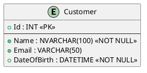
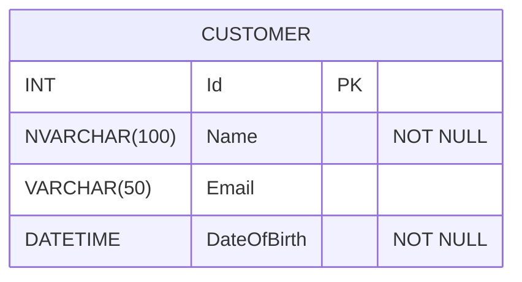
```spl
CREATE TABLE Customers (
    Id INT PRIMARY KEY,
    Name NVARCHAR(100) NOT NULL,
    Email VARCHAR(50),
    DateOfBirth DATETIME NOT NULL
);
```
```csharp
public class Customer
{
    [Key]
    public int Id { get; set; }

    [Required] //not null
    [MaxLength(100)]
    public string Name { get; set; }

    [Column(TypeName = "varchar(50)")] //データベースの型
    public string Email { get; set; }

    [Required] //not null
    public DateTime DateOfBirth { get; set; }
}
```
```csharp
//Fluent API
using Microsoft.EntityFrameworkCore;

public class ApplicationDbContext : DbContext
{
    public DbSet<Customer> Customers { get; set; }

    protected override void OnConfiguring(DbContextOptionsBuilder optionsBuilder)
    {
        optionsBuilder.UseSqlServer("YourConnectionStringHere");
    }

    protected override void OnModelCreating(ModelBuilder modelBuilder)
    {
        // Fluent APIでの構成も可能
        modelBuilder.Entity<Customer>(entity =>
        {
            entity.HasKey(e => e.Id);
            entity.Property(e => e.Name).IsRequired().HasMaxLength(100);
            entity.Property(e => e.Email).HasColumnType("varchar(50)");
            entity.Property(e => e.DateOfBirth).IsRequired();
        });
    }
}
```

## 1..1
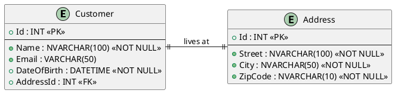

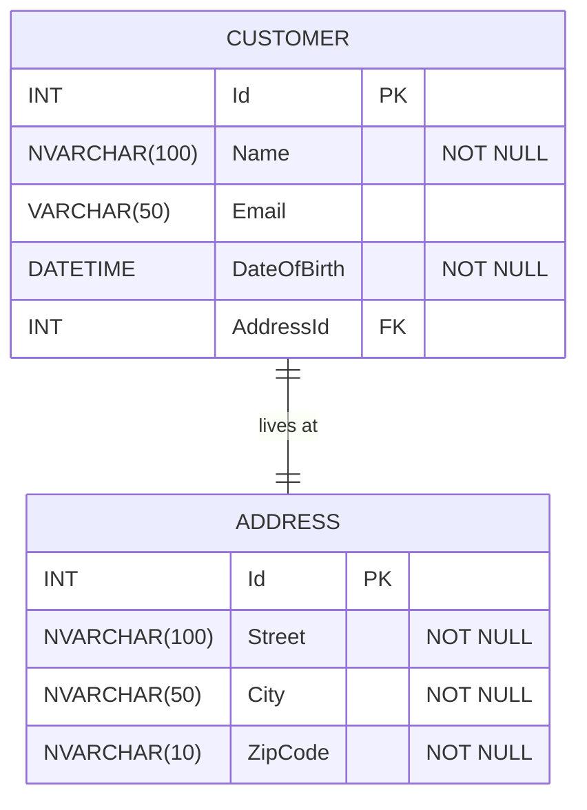
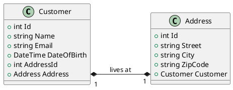
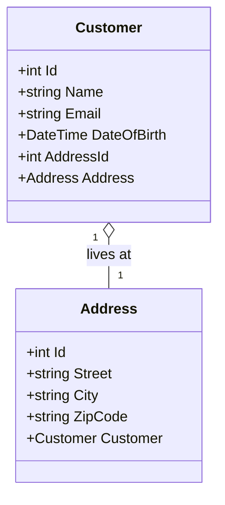
```csharp
using System.ComponentModel.DataAnnotations;
using System.ComponentModel.DataAnnotations.Schema;

public class Customer
{
    [Key]
    public int Id { get; set; }

    [Required]
    [MaxLength(100)]
    public string Name { get; set; }

    [Column(TypeName = "varchar(50)")]
    public string Email { get; set; }

    [Required]
    public DateTime DateOfBirth { get; set; }

    // Foreign key for Address
    public int AddressId { get; set; }

    // Navigation property for the related Address
    public Address Address { get; set; }
}
```
```csharp
using System.ComponentModel.DataAnnotations;

public class Address
{
    [Key]
    public int Id { get; set; }

    [Required]
    [MaxLength(100)]
    public string Street { get; set; }

    [Required]
    [MaxLength(50)]
    public string City { get; set; }

    [Required]
    [MaxLength(10)]
    public string ZipCode { get; set; }

    // Navigation property for the related Customer
    public Customer Customer { get; set; }
}

```
```csharp
//DbContext
using Microsoft.EntityFrameworkCore;

public class ApplicationDbContext : DbContext
{
    public DbSet<Customer> Customers { get; set; }
    public DbSet<Address> Addresses { get; set; }

    protected override void OnConfiguring(DbContextOptionsBuilder optionsBuilder)
    {
        optionsBuilder.UseSqlServer("YourConnectionStringHere");
    }

    protected override void OnModelCreating(ModelBuilder modelBuilder)
    {
        modelBuilder.Entity<Customer>()
            .HasOne(c => c.Address)
            .WithOne(a => a.Customer)
            .HasForeignKey<Customer>(c => c.AddressId);

        modelBuilder.Entity<Customer>(entity =>
        {
            entity.HasKey(e => e.Id);
            entity.Property(e => e.Name).IsRequired().HasMaxLength(100);
            entity.Property(e => e.Email).HasColumnType("varchar(50)");
            entity.Property(e => e.DateOfBirth).IsRequired();
            entity.HasOne(e => e.Address).WithOne(a => a.Customer).HasForeignKey<Customer>(e => e.AddressId);
        });

        modelBuilder.Entity<Address>(entity =>
        {
            entity.HasKey(e => e.Id);
            entity.Property(e => e.Street).IsRequired().HasMaxLength(100);
            entity.Property(e => e.City).IsRequired().HasMaxLength(50);
            entity.Property(e => e.ZipCode).IsRequired().HasMaxLength(10);
        });
    }
}
```
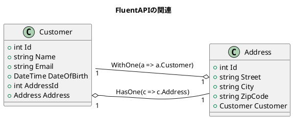
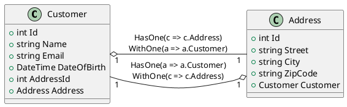

## 1..*
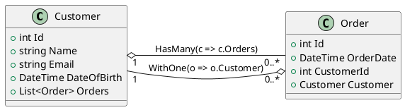
```csharp
using Microsoft.EntityFrameworkCore;

public class ApplicationDbContext : DbContext
{
    public DbSet<Customer> Customers { get; set; }
    public DbSet<Order> Orders { get; set; }

    protected override void OnConfiguring(DbContextOptionsBuilder optionsBuilder)
    {
        optionsBuilder.UseSqlServer("YourConnectionStringHere");
    }

    protected override void OnModelCreating(ModelBuilder modelBuilder)
    {
        modelBuilder.Entity<Customer>()
            .HasMany(c => c.Orders)
            .WithOne(o => o.Customer)
            .HasForeignKey(o => o.CustomerId);

        modelBuilder.Entity<Order>(entity =>
        {
            entity.HasKey(e => e.Id);
            entity.Property(e => e.OrderDate).IsRequired();
            entity.HasOne(e => e.Customer)
                  .WithMany(c => c.Orders)
                  .HasForeignKey(e => e.CustomerId);
        });
    }
}

public class Customer
{
    public int Id { get; set; }
    public string Name { get; set; }
    public string Email { get; set; }
    public DateTime DateOfBirth { get; set; }
    public List<Order> Orders { get; set; }
}

public class Order
{
    public int Id { get; set; }
    public DateTime OrderDate { get; set; }
    public int CustomerId { get; set; }
    public Customer Customer { get; set; }
}

```

---
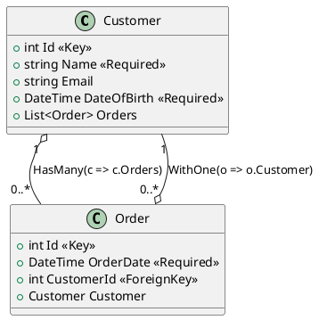
```csharp
using Microsoft.EntityFrameworkCore;
using System.Collections.Generic;
using System.ComponentModel.DataAnnotations;
using System.ComponentModel.DataAnnotations.Schema;

public class ApplicationDbContext : DbContext
{
    public DbSet<Customer> Customers { get; set; }
    public DbSet<Order> Orders { get; set; }

    protected override void OnConfiguring(DbContextOptionsBuilder optionsBuilder)
    {
        optionsBuilder.UseSqlServer("YourConnectionStringHere");
    }

    protected override void OnModelCreating(ModelBuilder modelBuilder)
    {
        modelBuilder.Entity<Customer>()
            .HasMany(c => c.Orders) // CustomerとOrderの間に1対多の集約関係を示し、HasManyのFluent API設定をコメントとして追加
            .WithOne(o => o.Customer) // OrderとCustomerの間に多対1の集約関係を示し、WithOneのFluent API設定をコメントとして追加
            .HasForeignKey(o => o.CustomerId);

        modelBuilder.Entity<Order>(entity =>
        {
            entity.HasKey(e => e.Id);
            entity.Property(e => e.OrderDate).IsRequired();
            entity.HasOne(e => e.Customer)
                  .WithMany(c => c.Orders)
                  .HasForeignKey(e => e.CustomerId);
        });
    }
}

public class Customer
{
    [Key]
    public int Id { get; set; }

    [Required]
    [MaxLength(100)]
    public string Name { get; set; }

    [EmailAddress]
    public string Email { get; set; }

    [Required]
    public DateTime DateOfBirth { get; set; }

    public List<Order> Orders { get; set; }
}

public class Order
{
    [Key]
    public int Id { get; set; }

    [Required]
    public DateTime OrderDate { get; set; }

    [ForeignKey("Customer")]
    public int CustomerId { get; set; }

    public Customer Customer { get; set; }
}

```

## \*..\*
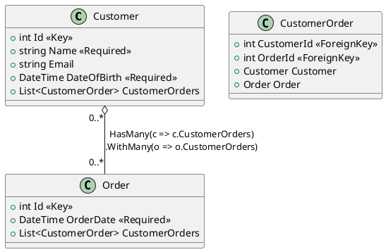
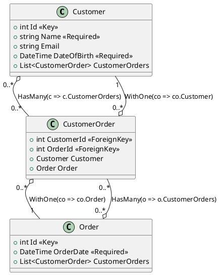

```csharp
using Microsoft.EntityFrameworkCore;
using System.Collections.Generic;
using System.ComponentModel.DataAnnotations;
using System.ComponentModel.DataAnnotations.Schema;

public class ApplicationDbContext : DbContext
{
    public DbSet<Customer> Customers { get; set; }
    public DbSet<Order> Orders { get; set; }
    public DbSet<CustomerOrder> CustomerOrders { get; set; }

    protected override void OnConfiguring(DbContextOptionsBuilder optionsBuilder)
    {
        optionsBuilder.UseSqlServer("YourConnectionStringHere");
    }

    protected override void OnModelCreating(ModelBuilder modelBuilder)
    {
        modelBuilder.Entity<Customer>()
            .HasMany(c => c.CustomerOrders) // CustomerとCustomerOrderの間に多対多の関係を示し、HasManyのFluent API設定をコメントとして追加
            .WithOne(co => co.Customer) // CustomerOrderとCustomerの間に多対1の関係を示し、WithOneのFluent API設定をコメントとして追加
            .HasForeignKey(co => co.CustomerId);

        modelBuilder.Entity<Order>()
            .HasMany(o => o.CustomerOrders) // OrderとCustomerOrderの間に多対多の関係を示し、HasManyのFluent API設定をコメントとして追加
            .WithOne(co => co.Order) // CustomerOrderとOrderの間に多対1の関係を示し、WithOneのFluent API設定をコメントとして追加
            .HasForeignKey(co => co.OrderId);

        modelBuilder.Entity<CustomerOrder>()
            .HasKey(co => new { co.CustomerId, co.OrderId });
    }
}

public class Customer
{
    [Key]
    public int Id { get; set; }

    [Required]
    [MaxLength(100)]
    public string Name { get; set; }

    [EmailAddress]
    public string Email { get; set; }

    [Required]
    public DateTime DateOfBirth { get; set; }

    //*..*
    public List<CustomerOrder> CustomerOrders { get; set; }
}

public class Order
{
    [Key]
    public int Id { get; set; }

    [Required]
    public DateTime OrderDate { get; set; }

    //*..*
    public List<CustomerOrder> CustomerOrders { get; set; }
}

public class CustomerOrder
{
    [ForeignKey("Customer")]
    public int CustomerId { get; set; }

    [ForeignKey("Order")]
    public int OrderId { get; set; }

    //NavigationProperty
    public Customer Customer { get; set; }
    public Order Order { get; set; }
}

```
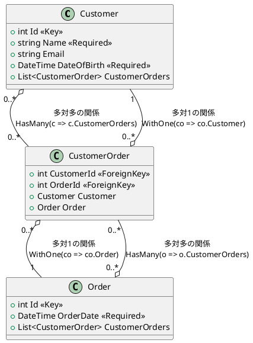
