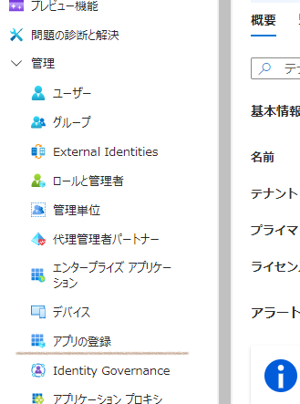
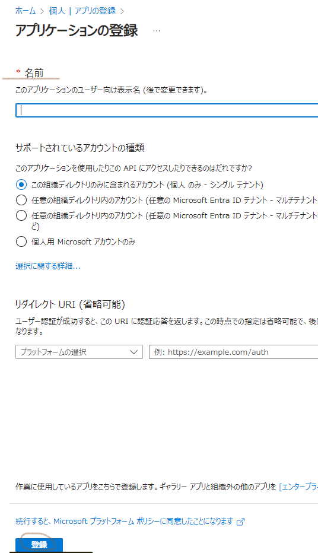
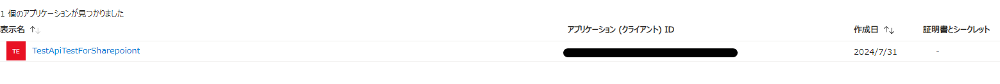
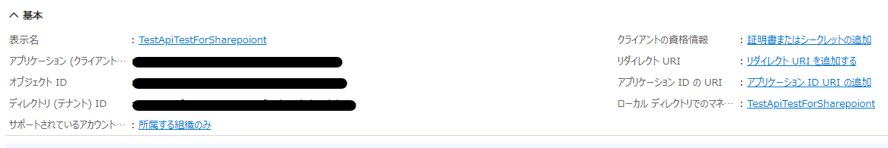
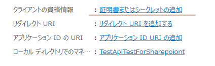

# SharePoint での RestAPI使用法

## 前提条件

1. SharePointサイトのURL: 例 https://yoursharepointsite.sharepoint.com/sites/yoursite
1. リストの名前またはID: 例 YourList
1. 更新するリストアイテムのID: 例 1
1. 認証情報: REST APIを使用するために必要なアクセストークンまたは認証情報

## 認証トークン

REST APIを使用するためには認証トークンが必要
Azure ADなどの認証プロバイダーを使用してアクセストークンを取得する

### Azure ADアプリケーションを登録する

[Azure portal](https://portal.azure.com/#home)にアクセスする

Azure AD は、Microsoft Entra ID に名前が[変更](https://learn.microsoft.com/ja-jp/entra/fundamentals/new-name)になっているので注意。

#### アプリの登録を選択


#### アプリの登録内容
リダイレクトURIは、認証コードフローを使用する場合、適切なリダイレクトURI（例えば、https://localhostなど）を指定する


#### 登録された


### アプリケーションの「概要」で確認


- クライアントID
- テナントID

を控える

### 「証明書とシークレット」で「新しいクライアントシークレット」を作成



「Add a certificate or secret」で作成する

作成した
シークレットの値は安全な場所に保存する。後で必要になる。

## アクセストークンの取得

アクセストークンを取得するためには、
OAuth 2.0認証フローの一部としてHTTPリクエストを送信
以下は、クライアント資格情報フローを使用した例

### python
requestsライブラリを使用してHTTPリクエストを送信

```bash
pip install requests
```
```python
import requests

tenant_id = "YOUR_TENANT_ID"
client_id = "YOUR_CLIENT_ID"
client_secret = "YOUR_CLIENT_SECRET"
scope = "https://graph.microsoft.com/.default"  # 使用するスコープ

url = f"https://login.microsoftonline.com/{tenant_id}/oauth2/v2.0/token"

headers = {
    "Content-Type": "application/x-www-form-urlencoded"
}

data = {
    "grant_type": "client_credentials",
    "client_id": client_id,
    "client_secret": client_secret,
    "scope": scope
}

response = requests.post(url, headers=headers, data=data)

if response.status_code == 200:
    access_token = response.json().get("access_token")
    print("Access Token:", access_token)
else:
    print("Error:", response.json())
```

使用するスコープは、
SharePointの場合 https://{tenant}.sharepoint.com/.default など
対象となるリソースに応じて変更する

クライアントIDとシークレットを使用してトークンを取得するので、
セキュリティを確保するためこれらの情報を安全に管理する必要がある


### HTML, js
MSAL.jsライブラリを使用する
```html
<script src="https://alcdn.msauth.net/browser/2.16.0/js/msal-browser.min.js"></script>
```

SignInボタンでサインインを行う。
```html
<!DOCTYPE html>
<html>
<head>
    <title>Get Azure AD Token</title>
    <script src="https://alcdn.msauth.net/browser/2.16.0/js/msal-browser.min.js"></script>
</head>
<body>
    <h1>Get Azure AD Token</h1>
    <button onclick="signIn()">Sign In</button>
    <pre id="output"></pre>

    <script>
        // グローバル変数として定義
        const clientId = "YOUR_CLIENT_ID";
        const tenantId = "YOUR_TENANT_ID";
        const authority = `https://login.microsoftonline.com/${tenantId}`;
        const redirectUri = "http://localhost"; // Azure Portalで設定したリダイレクトURIに一致させる
        const scopes = ["https://graph.microsoft.com/.default"];

        // MSALの設定
        const msalConfig = {
            auth: {
                clientId: clientId,
                authority: authority,
                redirectUri: redirectUri
            }
        };

        const msalInstance = new msal.PublicClientApplication(msalConfig);

        // サインイン関数
        function signIn() {
            const loginRequest = {
                scopes: scopes
            };

            msalInstance.loginPopup(loginRequest)
                .then(loginResponse => {
                    console.log("Login successful!");
                    console.log("Login Response:", loginResponse);
                    getAccessToken(loginResponse);
                })
                .catch(error => {
                    console.error("Login error:", error);
                });
        }

        // アクセストークン取得関数
        function getAccessToken(loginResponse) {
            const tokenRequest = {
                scopes: scopes,
                account: loginResponse.account // アカウント情報を追加
            };

            msalInstance.acquireTokenSilent(tokenRequest)
                .then(tokenResponse => {
                    console.log("Token Response:", tokenResponse);
                    document.getElementById("output").textContent = tokenResponse.accessToken;
                })
                .catch(error => {
                    console.error("Token error:", error);

                    // Acquire token via popup if silent acquisition fails
                    msalInstance.acquireTokenPopup(tokenRequest)
                        .then(tokenResponse => {
                            console.log("Token Response (popup):", tokenResponse);
                            document.getElementById("output").textContent = tokenResponse.accessToken;
                        })
                        .catch(popupError => {
                            console.error("Token error (popup):", popupError);
                        });
                });
        }
    </script>
</body>
</html>
```
さらに細かいログ出力
```html
<!DOCTYPE html>
<html>
<head>
    <title>Get Azure AD Token</title>
    <script src="https://alcdn.msauth.net/browser/2.16.0/js/msal-browser.min.js"></script>
</head>
<body>
    <h1>Get Azure AD Token</h1>
    <button onclick="signIn()">Sign In</button>
    <pre id="output"></pre>

    <script>
        // グローバル変数として定義
        const clientId = "YOUR_CLIENT_ID";
        const tenantId = "YOUR_TENANT_ID";
        const authority = `https://login.microsoftonline.com/${tenantId}`;
        const redirectUri = "http://localhost"; // Azure Portalで設定したリダイレクトURIに一致させる
        const scopes = ["https://graph.microsoft.com/.default"];

        // MSALの設定
        const msalConfig = {
            auth: {
                clientId: clientId,
                authority: authority,
                redirectUri: redirectUri
            }
        };

        const msalInstance = new msal.PublicClientApplication(msalConfig);

        // サインイン関数
        function signIn() {
            const loginRequest = {
                scopes: scopes
            };

            msalInstance.loginPopup(loginRequest)
                .then(loginResponse => {
                    console.log("Login successful!");
                    console.log("Login Response:", loginResponse);
                    getAccessToken(loginResponse);
                })
                .catch(error => {
                    console.error("Login error:", error);
                    document.getElementById("output").textContent = `Login error: ${error.message}`;
                });
        }

        // アクセストークン取得関数
        function getAccessToken(loginResponse) {
            const tokenRequest = {
                scopes: scopes,
                account: loginResponse.account // アカウント情報を追加
            };

            msalInstance.acquireTokenSilent(tokenRequest)
                .then(tokenResponse => {
                    console.log("Token Response:", tokenResponse);
                    document.getElementById("output").textContent = tokenResponse.accessToken;
                })
                .catch(error => {
                    console.error("Token error:", error);

                    // Acquire token via popup if silent acquisition fails
                    msalInstance.acquireTokenPopup(tokenRequest)
                        .then(tokenResponse => {
                            console.log("Token Response (popup):", tokenResponse);
                            document.getElementById("output").textContent = tokenResponse.accessToken;
                        })
                        .catch(popupError => {
                            console.error("Token error (popup):", popupError);
                            document.getElementById("output").textContent = `Token error (popup): ${popupError.message}`;
                        });
                });
        }
    </script>
</body>
</html>

```
### C#
Microsoft.Identity.Clientライブラリを使用
NuGetで、Microsoft.Identity.Client をインストール
```bash
Install-Package Microsoft.Identity.Client
```
```csharp
using System;
using System.Threading.Tasks;
using Microsoft.Identity.Client;

namespace AzureADToken
{
    class Program
    {
        private const string _clientId = "YOUR_CLIENT_ID";
        private const string _tenantId = "YOUR_TENANT_ID";
        private const string _clientSecret = "YOUR_CLIENT_SECRET";
        private const string _authority = $"https://login.microsoftonline.com/{_tenantId}";
        private const string _scope = "https://graph.microsoft.com/.default";

        static async Task Main(string[] args)
        {
            var app = ConfidentialClientApplicationBuilder.Create(_clientId)
                .WithClientSecret(_clientSecret)
                .WithAuthority(new Uri(_authority))
                .Build();

            var scopes = new string[] { _scope };

            try
            {
                var result = await app.AcquireTokenForClient(scopes)
                    .ExecuteAsync();

                Console.WriteLine("Access Token: " + result.AccessToken);
            }
            catch (Exception ex)
            {
                Console.WriteLine("Error acquiring token: " + ex.Message);
            }
        }
    }
}
```

## RestAPIの使用

### Get 特定の列の一致するレコードの別の特定の列の値を取得

```csharp
using System;
using System.Net.Http;
using System.Net.Http.Headers;
using System.Threading.Tasks;
using Newtonsoft.Json.Linq;

namespace SharePointAccess
{
    class Program
    {
        private const string addrSharePoint = "https://yoursharepointsite.sharepoint.com";
        private const string listName = "YourListName";
        private const string columnName1 = "ColumnNameToSearch";
        private const string columnName2 = "ColumnNameToRetrieve";
        private const string queryValue = "ValueToSearchFor";
        private static string accessToken = "YOUR_ACCESS_TOKEN";

        static async Task Main(string[] args)
        {
            try
            {
                string result = await GetListItemValueAsync(addrSharePoint, listName, columnName1, queryValue, columnName2);
                if (!string.IsNullOrEmpty(result))
                {
                    Console.WriteLine($"Value in {columnName2}: {result}");
                }
                else
                {
                    Console.WriteLine("No matching item found.");
                }
            }
            catch (Exception ex)
            {
                Console.WriteLine("Error: " + ex.Message);
            }
        }

        private static async Task<string> GetListItemValueAsync(string siteUrl, string listName, string columnNameToSearch, string queryValue, string columnNameToRetrieve)
        {
            using (var httpClient = new HttpClient())
            {
                // Set up the HTTP client
                httpClient.DefaultRequestHeaders.Authorization = new AuthenticationHeaderValue("Bearer", accessToken);
                httpClient.DefaultRequestHeaders.Accept.Add(new MediaTypeWithQualityHeaderValue("application/json"));

                // Construct the query URL
                string queryUrl = $"{siteUrl}/_api/web/lists/getbytitle('{listName}')/items?$filter={columnNameToSearch} eq '{queryValue}'";

                // Send the HTTP request
                HttpResponseMessage response = await httpClient.GetAsync(queryUrl);

                if (response.IsSuccessStatusCode)
                {
                    string responseBody = await response.Content.ReadAsStringAsync();
                    JObject jsonResponse = JObject.Parse(responseBody);

                    // Check if any items were returned
                    if (jsonResponse["value"] != null && jsonResponse["value"].HasValues)
                    {
                        // Retrieve the value of the specified column
                        JToken firstItem = jsonResponse["value"].First;
                        return firstItem[columnNameToRetrieve]?.ToString();
                    }
                }
                else
                {
                    throw new Exception($"Failed to get list items: {response.ReasonPhrase}");
                }
            }

            return null;
        }
    }
}
```
```html
<!DOCTYPE html>
<html>
<head>
    <title>Get SharePoint List Item</title>
    <script src="https://alcdn.msauth.net/browser/2.16.0/js/msal-browser.min.js"></script>
</head>
<body>
    <h1>Get SharePoint List Item</h1>
    <button onclick="signIn()">Sign In</button>
    <div id="result"></div>

    <script>
        // グローバル変数として定義
        const clientId = "YOUR_CLIENT_ID"; // Azure ADアプリケーションのクライアントID
        const tenantId = "YOUR_TENANT_ID"; // Azure ADテナントID
        const redirectUri = "http://localhost:3000"; // リダイレクトURI
        const siteUrl = "https://yoursharepointsite.sharepoint.com"; // SharePointサイトのURL
        const listName = "YourListName"; // リスト名
        const columnName1 = "ColumnNameToSearch"; // 検索する列の名前
        const columnName2 = "ColumnNameToRetrieve"; // 取得する列の名前
        const queryValue = "ValueToSearchFor"; // 検索する値

        // MSAL configuration
        const msalConfig = {
            auth: {
                clientId: clientId,
                authority: `https://login.microsoftonline.com/${tenantId}`,
                redirectUri: redirectUri
            }
        };

        const msalInstance = new msal.PublicClientApplication(msalConfig);

        // Sign in function
        async function signIn() {
            try {
                const loginResponse = await msalInstance.loginPopup({
                    scopes: ["https://graph.microsoft.com/.default"]
                });

                console.log("Login successful!");
                console.log("Login Response:", loginResponse);
                const accessToken = loginResponse.accessToken;

                // Fetch SharePoint list item
                const result = await getListItemValue(accessToken);
                document.getElementById("result").innerText = `Value in ${columnName2}: ${result}`;
            } catch (error) {
                console.error("Login error:", error);
                document.getElementById("result").innerText = `Login error: ${error.message}`;
            }
        }

        // Function to fetch list item value
        async function getListItemValue(accessToken) {
            const url = `${siteUrl}/_api/web/lists/getbytitle('${listName}')/items?$filter=${columnName1} eq '${queryValue}'`;

            const response = await fetch(url, {
                method: "GET",
                headers: {
                    "Authorization": `Bearer ${accessToken}`,
                    "Accept": "application/json;odata=verbose"
                }
            });

            if (response.ok) {
                const data = await response.json();
                if (data.d.results.length > 0) {
                    return data.d.results[0][columnName2];
                } else {
                    return "No matching item found.";
                }
            } else {
                throw new Error(`Failed to get list items: ${response.statusText}`);
            }
        }
    </script>
</body>
</html>
```

## NodeJs サーバー
NodeJsインストールして、その後
コマンドラインで、
```ps1
npm install -g http-server
```
でインストール
```ps1
npm config get prefix
```
任意にディレクトリを作製し、htmlファイルを保存
そのディレクトリで
以下のコマンドでサーバー起動。
```ps1
http-server
http-server -p 3000
```
### オプション
-a または --address：サーバーがリッスンするアドレスを指定（デフォルトは 0.0.0.0）
-p または --port：サーバーがリッスンするポートを指定（デフォルトは 8080）
-d または --directory：サーバーが提供するディレクトリを指定（デフォルトは .）
-o または --open：サーバー起動時にブラウザを自動的に開く


